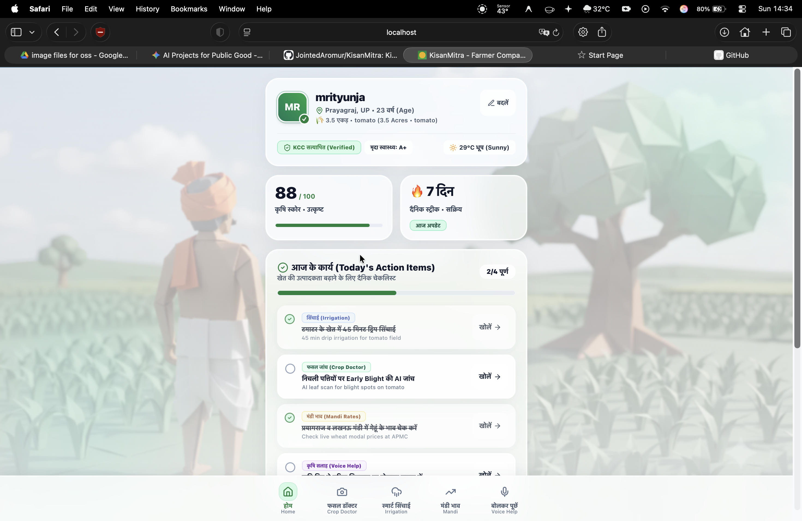
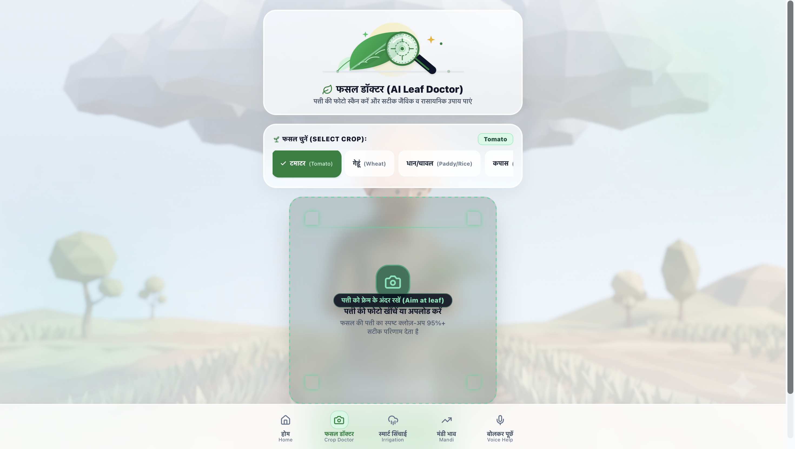
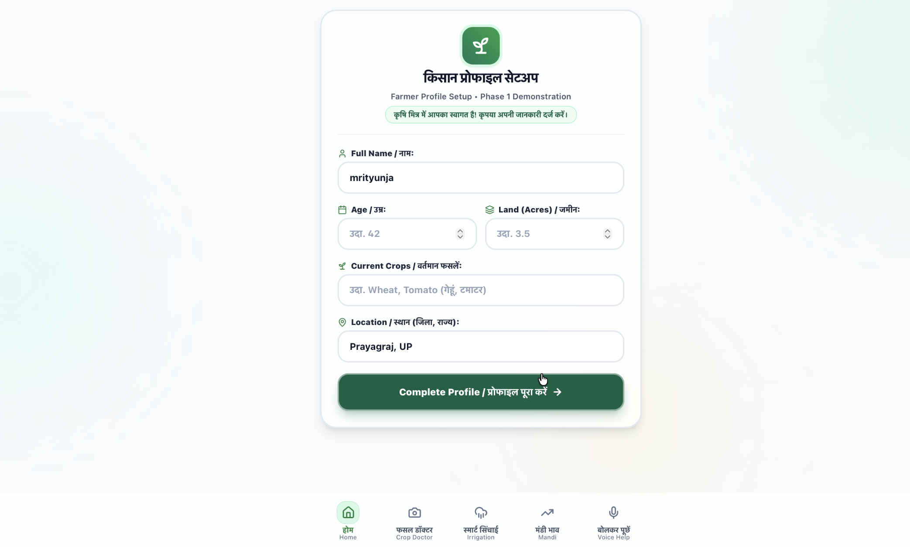

# KisanMitra (किसान मित्र) 🌱
**An AI-powered, accessible digital assistant for marginalized Indian farmers.**

**Hackathon:** OOSC 4.0 (IIIT Allahabad)
**Track:** Problem Statement 5 - AI for Public Good
**Team:** Mrityunjay Yadav, Binay Tiwari, Rishab Gupta

## 📸 Screenshots





## 📌 What it Does
KisanMitra is a Progressive Web App (PWA) designed for low-connectivity environments. It provides actionable agricultural intelligence through an ultra-minimal, glassmorphic, multilingual interface.

*   **Crop Doctor:** AI-driven image analysis (Gemini Vision) to instantly diagnose plant diseases and suggest localized treatments.
*   **Smart Irrigation:** Cross-references last watering dates with 48-hour hyper-local weather forecasts to prevent crop loss.
*   **Mandi Rates:** Real-time commodity market prices to ensure fair compensation.
*   **Accessible UI:** Voice-to-text inputs and audio readouts for low-literacy users.

## 💻 Tech Stack
*   **Frontend:** Next.js, React, Tailwind CSS (Glassmorphism)
*   **Backend:** Node.js, Express
*   **AI & APIs:** Google Gemini, OpenWeatherMap, Agmarknet

## 🚀 How to Run Locally
1. Clone the repository and navigate into the folder.
2. Create a `.env` file in the root with your `GEMINI_API_KEY` and `OPENWEATHER_API_KEY`.
3. Install dependencies:
   ```bash
   npm install